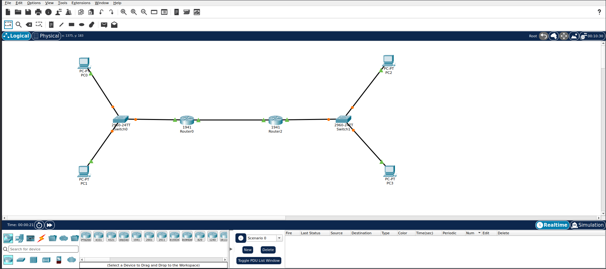

# 🌐 Cisco Packet Tracer — Static Routing Lab



My first practical networking lab using **Cisco Packet Tracer**.

In this lab, I built a small network consisting of two separate LANs connected through two routers, then configured **Static Routing** to allow hosts in one network to communicate with hosts in the other network.

---

## 🎯 What I Learned

Before building the lab, I studied some networking fundamentals:

* Host
* Network
* Internet
* Server & Client
* Router / Gateway
* Packet
* IP Address
* Subnet Mask
* DHCP
* DNS
* Ethernet
* TCP/IP

I then applied some of these concepts practically using Cisco Packet Tracer.

---

## 🗺️ Network Topology

```text
                 Network 1
                10.0.1.0/24
                     │
                  Switch0
                 /       \
               PC0       PC1
           10.0.1.2    10.0.1.3
                 \       /
                  \     /
               G0/0
            10.0.1.1/24
               ┌─────────┐
               │ Router0 │
               └────┬────┘
                    │
              G0/1  │  10.0.0.1/30
                    │
            10.0.0.0/30
             Router Link
                    │
              G0/1  │  10.0.0.2/30
               ┌────┴────┐
               │ Router2 │
               └────┬────┘
                    │
               G0/0  │  10.0.2.1/24
                    │
                  Switch1
                 /       \
               PC2       PC3
           10.0.2.2    10.0.2.3
                     │
                Network 2
               10.0.2.0/24
```

---

## 📋 IP Addressing

### Network 1

| Device  | Interface | IP Address | Subnet Mask     | Default Gateway |
| ------- | --------- | ---------- | --------------- | --------------- |
| PC0     | Ethernet  | `10.0.1.2` | `255.255.255.0` | `10.0.1.1`      |
| PC1     | Ethernet  | `10.0.1.3` | `255.255.255.0` | `10.0.1.1`      |
| Router0 | G0/0      | `10.0.1.1` | `255.255.255.0` | —               |

### Network 2

| Device  | Interface | IP Address | Subnet Mask     | Default Gateway |
| ------- | --------- | ---------- | --------------- | --------------- |
| PC2     | Ethernet  | `10.0.2.2` | `255.255.255.0` | `10.0.2.1`      |
| PC3     | Ethernet  | `10.0.2.3` | `255.255.255.0` | `10.0.2.1`      |
| Router2 | G0/0      | `10.0.2.1` | `255.255.255.0` | —               |

### Router-to-Router Network

| Device  | Interface | IP Address | Subnet Mask       |
| ------- | --------- | ---------- | ----------------- |
| Router0 | G0/1      | `10.0.0.1` | `255.255.255.252` |
| Router2 | G0/1      | `10.0.0.2` | `255.255.255.252` |

---

# 🔧 Router Configuration

## Router0

```bash
enable
configure terminal

interface gigabitEthernet 0/0
ip address 10.0.1.1 255.255.255.0
no shutdown

interface gigabitEthernet 0/1
ip address 10.0.0.1 255.255.255.252
no shutdown
```

## Router2

```bash
enable
configure terminal

interface gigabitEthernet 0/0
ip address 10.0.2.1 255.255.255.0
no shutdown

interface gigabitEthernet 0/1
ip address 10.0.0.2 255.255.255.252
no shutdown
```

---

# 🛣️ Static Routing

The two routers know their directly connected networks automatically.

However, Router0 does not initially know how to reach:

```text
10.0.2.0/24
```

So I added a static route.

### Router0

```bash
ip route 10.0.2.0 255.255.255.0 10.0.0.2
```

The **next-hop** is:

```text
10.0.0.2
```

which is the IP address of Router2 on the router-to-router network.

---

Router2 also needs to know how to reach Network 1:

```text
10.0.1.0/24
```

### Router2

```bash
ip route 10.0.1.0 255.255.255.0 10.0.0.1
```

The **next-hop** is:

```text
10.0.0.1
```

which is the IP address of Router0.

---

# 🔍 Verification

To check the router interfaces:

```bash
show ip interface brief
```

### Router0

```text
GigabitEthernet0/0    10.0.1.1    YES manual    up    up
GigabitEthernet0/1    10.0.0.1    YES manual    up    up
```

### Router2

```text
GigabitEthernet0/0    10.0.2.1    YES manual    up    up
GigabitEthernet0/1    10.0.0.2    YES manual    up    up
```

---

## 🛣️ Checking the Routing Table

I used:

```bash
show ip route
```

Router0 shows:

```text
S 10.0.2.0/24 [1/0] via 10.0.0.2
```

Router2 shows:

```text
S 10.0.1.0/24 [1/0] via 10.0.0.1
```

The `S` means **Static Route**.

---

# 🧪 Connectivity Test

From PC0:

```text
ping 10.0.2.2
```

Result:

```text
Reply from 10.0.2.2: bytes=32 time<1ms TTL=126
Reply from 10.0.2.2: bytes=32 time<1ms TTL=126
Reply from 10.0.2.2: bytes=32 time<1ms TTL=126
Reply from 10.0.2.2: bytes=32 time<1ms TTL=126

Packets: Sent = 4, Received = 4, Lost = 0 (0% loss)
```

✅ Successful communication between the two different networks.
### 💡 Try It Yourself

Want to test the connectivity yourself?

Try using the `ping` command with the IP address of a device in the other network:

ping 10.0.2.2

You can also test other devices by using their IP addresses.
---

# 🧠 Key Concepts Practiced

### Host

A device that communicates over a network.

### Network

A group of connected hosts that can communicate with each other.

### IP Address

Used to identify a host on a network.

### Subnet Mask

Used to determine the network and host portions of an IP address.

### Default Gateway

The router interface used by a host when it needs to communicate outside its local network.

### Router

Connects different networks and forwards packets between them.

### Static Routing

A routing method where routes are manually configured by the network administrator.

### Next-Hop

The IP address of the next router to which a packet should be forwarded.

---

# 🛠️ Tools

* Cisco Packet Tracer
* Cisco IOS CLI
* IPv4
* Ethernet

---

# 📌 Lab Status

**Completed ✅**

This is my first practical networking lab while building my foundations in **Networking and Cybersecurity**.
